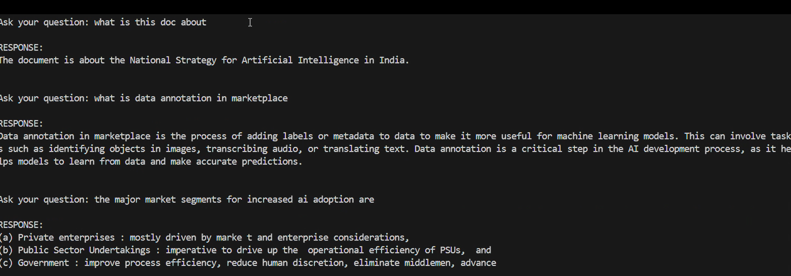

# **Documentation**

## **Introduction**
This system is designed to process large PDF and Excel files efficiently, extracting meaningful content and structuring it into manageable chunks. It provides the ability to query processed content using a Generative AI model, which offers responses based on the text extracted from the document. The system is optimized to handle files with complex elements like tables and to achieve high performance in terms of memory and processing speed.

---

### **Key Features**
1. Efficient Parallel PDF Processing: Using multiprocessing, the system processes PDF documents in parallel, improving processing time.
2. Text Extraction: Extracts text from PDFs while handling tables and complex formatting.
3. Chunking: Divides text into smaller chunks for efficient memory management, ensuring that content can be handled without consuming excessive resources.
4. Query model(gemini): Allows users to ask questions based on the document content, using a generative AI model for accurate and relevant responses.

---

## **System Architecture**

### **1. File Processing**
The system processes two types of files:

- PDF: Pages are extracted using the PyPDF2 library, which reads the PDF content. Tables within the content are also parsed and cleaned.
- Excel: Excel files are processed using pandas, extracting content from each sheet and converting it into text format.

### **2.  Chunking**
- The ChunkManager class manages how content is divided into chunks. This ensures preventing overload memory by keeping the content manageable. Each chunk is stored as a dictionary, which includes the extracted text and meta information such as page numbers, file type.
- Chunks are created based on the size of the content, ensuring that each chunk doesn't exceed the defined max_size.

### **3. Query Model**
- The queryModel class is responsible for querying the processed content. It uses Google Gemini to answer questions based on the extracted content. The model is fed relevant sections of the document to generate the best possible response.

### **4. Parallel Processing**
- PDF files are processed in parallel using the multiprocessing library. This allows the system to efficiently process multiple pages at once, significantly speeding up processing time for large documents.

### **5. Memory Optimization**
- The system is optimized to use minimal memory by breaking down documents into small chunks and processing them in parallel. This ensures that the system doesn't consume excessive memory even for large files.

---

## **Optimization Approaches**

### **1. Parallel and Concurrent Processing**
To ensure that the system can handle large documents quickly:
- Multiprocessing: The Pool class from the multiprocessing module was used to process PDF pages concurrently. This speeds up the processing time by distributing the work across multiple CPU cores.

### **2. Text Extraction Optimization**
-Efficient Text Extraction: The PyPDF2 library is used for extracting plain text from PDFs. For tables, regular expressions are used to identify and clean up the table data.
- Table Parsing: Tables are cleaned and formatted using regular expressions to convert multiple spaces into a delimiter, making them easier to handle and process.
### **3. Chunking Strategy**
- The ChunkManager class ensures that text is split into smaller chunks, making it easier to process and reducing memory usage. The max_size parameter is used to control the size of each chunk, optimizing the memory footprint.
- By processing smaller chunks of text at a time, the system avoids loading the entire document into memory, which helps in managing large files efficiently.

### **4. Memory Management**
- Efficient Chunking : By keeping the chunks small and manageable, the memory usage is kept low. Each chunk only holds the relevant text, and unnecessary data is not retained.

### **5. Gemini for Query Handling**
- Gemini is used to handle the queries. The system sends a prompt to the model, which generates a response based on the context extracted from the document.
- The query model is designed to extract the most relevant portions of the document based on keywords in the user's query.

---

## **Performance Benchmarks**

### **1. Processing Time**
- The system is optimized to process a 100-page PDF in under around 5 seconds.

### **2. Memory Usage**
- The tested document of over 100 pages used a memory of only 20MB.

## **How To Run The Program**

- Clone the repository.
- Install requirements by "pip install requirements.txt".
- run by "python main.py".

## **Demo Video**

- The demo video is given within the repository. In case of any error, use the link:https://drive.google.com/file/d/18IhJeNcTxiLdexbx7pAqfFyu3X2htdo-/view?usp=sharing.

- 

## **Instruction For Deployment**

- For basic implementation, streamlit can be used for basic ui ,functionalities and quick deployment.
